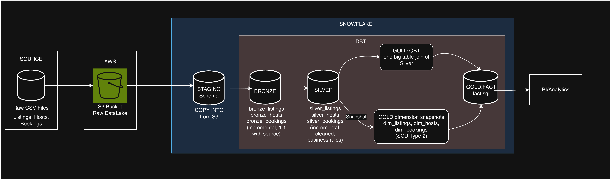

# Airbnb ELT Project — DBT + Snowflake + AWS

An end-to-end ELT (Extract, Load, Transform) pipeline that ingests raw Airbnb-style booking data and transforms it into analytics-ready tables in Snowflake using dbt, following a Bronze → Silver → Gold medallion architecture.

## Architecture



**Flow summary:** raw CSVs are uploaded to an S3 bucket, then loaded into a Snowflake `STAGING` schema (`COPY INTO`). dbt takes over from there — Bronze models land the raw staged data as incremental tables, Silver models clean and apply business logic, and Gold builds a one-big-table (`obt`) that's joined against `FACT` and SCD Type 2 dimension snapshots for historical tracking of listings, hosts, and bookings.


## Tech stack

| Layer | Tool |
|---|---|
| Storage / raw landing | AWS S3 |
| Data warehouse | Snowflake |
| Transformation | dbt-core, dbt-snowflake |
| Language / tooling | Python 3.12, uv (dependency management) |
| Source data | CSV (listings, hosts, bookings) |


## Repository structure

```
AIRBNB-ELT-PROJECT/
├── SourceData/                  # Raw CSVs: listings.csv, hosts.csv, bookings.csv
├── elt_de_project1/             # dbt project
│   ├── models/
│   │   ├── sources/sources.yml  # Declares STAGING.listings/bookings/hosts
│   │   ├── bronze/              # 1:1 incremental copies of staged source data
│   │   ├── silver/               # Cleaned, typed, business-rule-applied models
│   │   └── gold/
│   │       ├── obt.sql           # One-big-table join of all Silver models
│   │       ├── fact.sql          # Fact table joining OBT + Gold dimensions
│   │       └── ephemeral/        # Column subsets carved out of OBT
│   ├── snapshots/                # SCD Type 2 dimension snapshots (dim_listings, dim_hosts, dim_bookings)
│   ├── macros/                   # multiply, tag, trimmer, generate_schema_name
│   ├── tests/                    # Custom data tests (e.g. negative booking_amount check)
│   ├── seeds/, analyses/
│   └── dbt_project.yml
├── src/etl_de_project/           # Python package scaffold (uv project entry point)
├── pyproject.toml                # Python deps: dbt-core, dbt-snowflake
└── uv.lock
```

## Data model

**Bronze** — one model per source table (`bronze_listings`, `bronze_hosts`, `bronze_bookings`), materialized incrementally straight off `STAGING`, filtered on `CREATED_AT` for new rows only.

**Silver** — cleans and standardizes Bronze data: computed columns (e.g. `total_amount` via a custom `multiply()` macro), text normalization (`REPLACE`, trimming), and derived categorical fields (e.g. `response_rate_quality`, `price_per_night_tag` via a custom `tag()` macro). Also incremental, keyed on natural IDs (`listing_id`, `host_id`, `booking_id`).

**Gold** — `obt.sql` joins all three Silver models into a single wide table. From there, `ephemeral` models slice out per-entity column subsets, `fact.sql` joins the OBT against Gold-layer dimensions, and dbt **snapshots** (`dim_listings`, `dim_hosts`, `dim_bookings`) implement SCD Type 2 to preserve historical changes using a timestamp strategy.

**Tests** — a custom singular test flags any `bookings` row with a negative `booking_amount` (warn severity).


## Setup

**Prerequisites:** Python 3.12+, [uv](https://docs.astral.sh/uv/), a Snowflake account, an AWS S3 bucket with the source CSVs uploaded.

```bash
# Install dependencies
uv sync

# Configure your Snowflake connection 
export DBT_PROFILES_DIR=./elt_de_project1

# From the dbt project directory
cd elt_de_project1
dbt debug     # verify the Snowflake connection
dbt seed      # if using seeds
dbt run       # build bronze -> silver -> gold
dbt snapshot  # build SCD Type 2 dimension snapshots
dbt test      # run data tests
```

## Acknowledgments

Built by following [Airbnb End-To-End Data Engineering Project (For Beginners) | DBT + Snowflake + AWS](https://www.youtube.com/watch?v=3SZSDKEZqoA) as a learning project for transitioning into data engineering.
